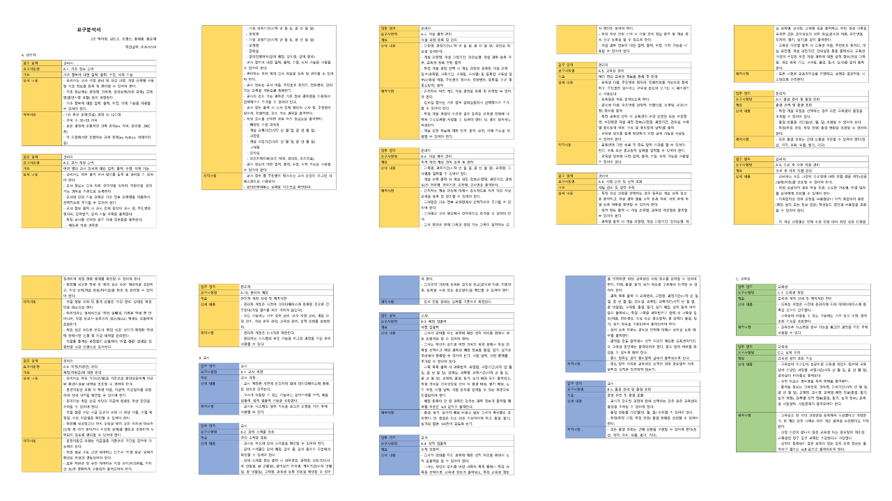
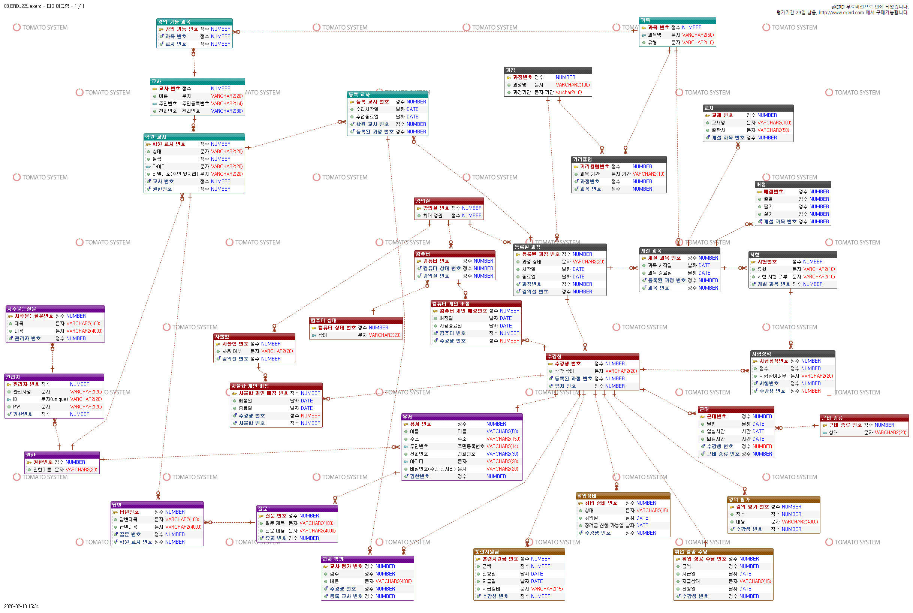
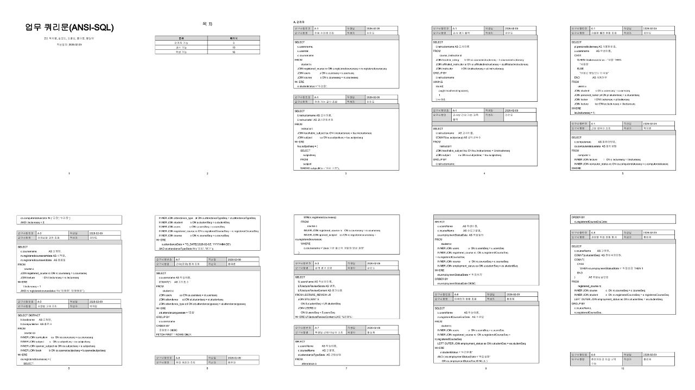
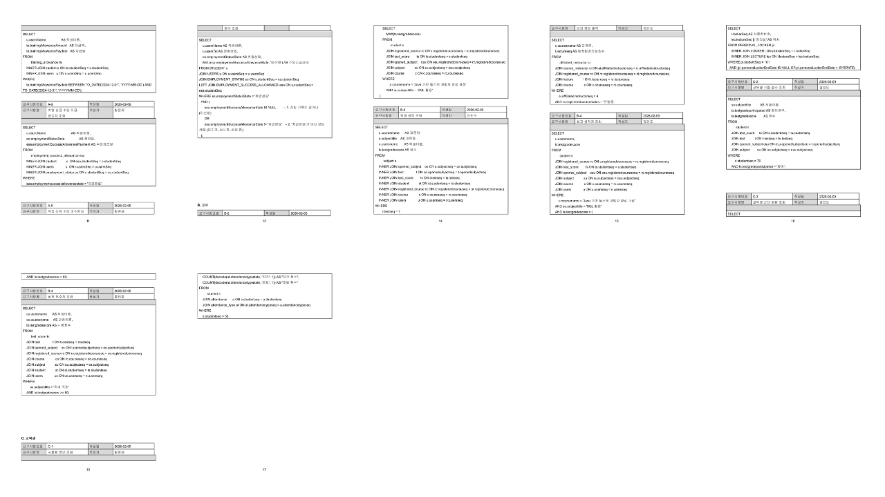

# 🏫 SIST 학원 관리 시스템 (SIST Learning Management System)

## 1. 프로젝트 개요
- **목적**: 학원의 학생, 성적, 기자재, 취업 현황을 효율적으로 관리하기 위한 통합 시스템
- **개발 기간**: 2026.02.03 ~ 2026.02.10 (약7일)
- **참여 인원**: 5명

## 2. 사용 기술
- **DB**: Oracle Database
- **Language**: Java(더미 데이터 생성), ANSI-SQL, PL/SQL
- **Tools**: DataGrip
- **헙업Tools**: Figma, Miro, Google Sheet

## 3. 주요 기능
### 👨‍💼 관리자 (Admin)
- 학생의 중도포기 출력 (프로시저 이용)
- 모든 학생의 대한 성적조회
- 특정일 근태 이상자 조회
- 기자재 사용여부 및 고장여부 확인

### 👩‍🏫 교사 (Teacher)
- 학생 성적 출력 및 등수 산출
- 기간별/과목별 출결 현황 조회 로직
- 강의 정보 출력

## 4. 요구분석

## 5. ERD 설계도

## 6. 업무쿼리문

